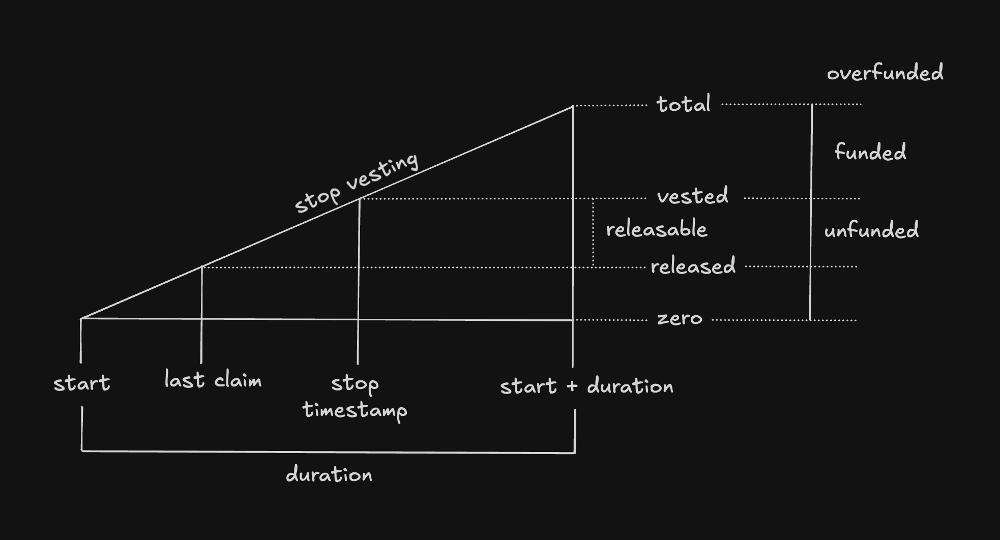
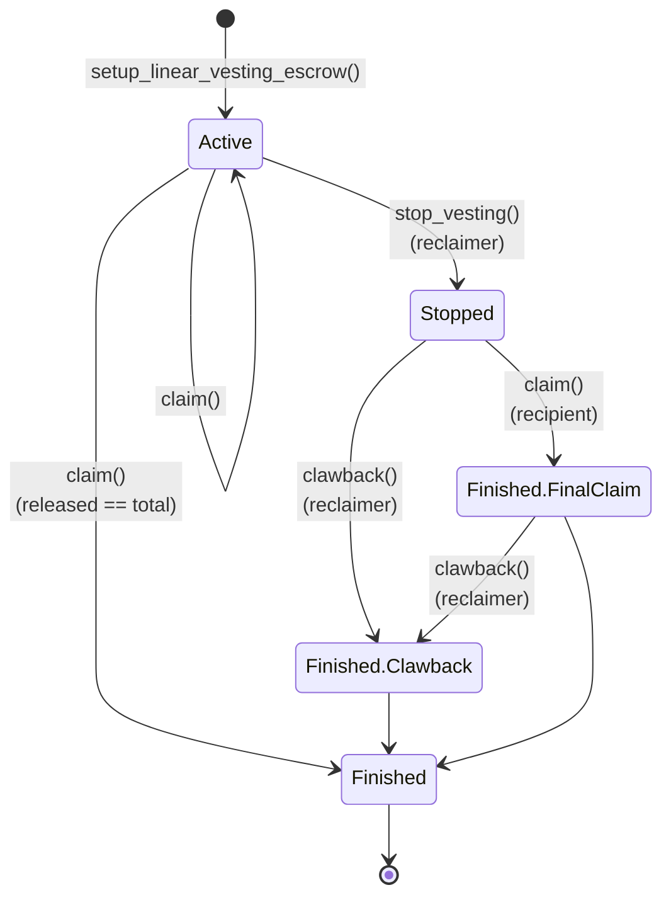

# Linear Vesting Escrow Logic Contract

The `LinearVestingEscrowLogic` contract supports privacy-preserving linear vesting schedules of escrowed tokens compliant with the [AIP-20 Aztec Token Standard](https://forum.aztec.network/t/request-for-comments-aip-20-aztec-token-standard/7737). The total amount to be vested must be defined at each escrow's setup, but the escrow itself can be funded at any point. It is the responsibility of the user to fund the escrow with the desired amount of tokens. Tokens sent to the escrow beyond the predefined amount can later be recovered by stopping the vesting and executing a clawback.

The `LinearVestingEscrowLogic` address can be publicly known and multiple independent linear vesting escrows can be setup with it without leaking any information.

The `LinearVestingEscrowLogic` should be used with escrow instances of the [standardized escrow implementation]( https://github.com/defi-wonderland/aztec-standards/tree/dev).

> ⚠️ **WARNING — Private Balance Loss**
>
> any tokens transferred to the Linear Vesting Escrow Logic's private balance will be lost forever, as the contract doesn't have keys to spend a private balance nor any recovery mechanism. Token must be sent to the Escrow contract.

## Design

The escrow instance is shared with the recipient and reclaimer, and used indirectly to share `vesting schedule` and `released amount` notes with them.

The `LinearVestingEscrowLogic` supports claims with a specific `claim_amount` during the duration of the vesting schedule. Each claim updates the `released amount note` with the effectively claimed amount.



Notice that the escrow contract is not necessarily 100% funded at all times. This gives flexibility in scenarios where vesting has a long duration for example.

The reclaimer can call `stop_vesting` at any moment, freezing the vesting schedule at the timestamp provided when calling. The timestamp needs to be greater than the transaction where this call is included.



Once stopped, the recipient can finish claiming or the reclaimer can clawback. A race condition exists because the recipient must be able to claim even after the vesting has been stopped, without relying on the reclaimer to call clawback, which may be delayed indefinitely or never occur.

Claiming after a stopped vesting is the _last claim possible_, only executable by the recipient, which finalizes the claims by setting `claim_complete` to `true`.

The reclaimer can clawback the escrow after the last claim or before. By doing so, it first withdraws any releasable amount remaining to the recipient, and then receives the amount specified in the call.

## Storage Fields
- `escrow_class_id: Field`: Contract Class ID of the escrow contract that the logic contract supports.
- `escrows: PrivateSet<VestingScheduleNote, Context>`: Note containing vesting schedule information for each escrow.
- `released_notes: PrivateSet<ReleasedAmountNote, Context>`: Note the tracks the amount of tokens already released for each escrow.

## Initializer Functions

### constructor
```rust
/// @dev Initialize the contract
/// @param escrow_class_id The contract class id of the escrow contract
#[public]
#[initializer]
fn constructor(escrow_class_id: Field) { /* ... */ }
```

## Private Functions

### setup_linear_vesting_escrow
```rust
/// @notice Creates a linear vesting escrow for the provided recipient.
/// @param escrow The address of the escrow
/// @param recipient The address of the recipient
/// @param reclaimer The address of the reclaimer
/// @param token The address of the token
/// @param start The start time of the vesting
/// @param duration The duration of the vesting
/// @param amount The total amount of tokens to vest
/// @param master_secret_keys The master secret keys
#[private]
fn setup_linear_vesting_escrow(
    escrow: AztecAddress,
    recipient: AztecAddress,
    reclaimer: AztecAddress,
    token: AztecAddress,
    start: u64,
    duration: u64,
    amount: u128,
    master_secret_keys: MasterSecretKeys,
) { /* ... */ }
```

### claim
```rust
/// @notice Claims what's available from the provided escrow
/// @dev The claim is only possible if the vesting is still active or is stopped but not completed
/// @dev Prevents claims after claim_completed is set to true in the released amount note to prevent potential
/// micro claims spam from the recipient
/// @param escrow The address of the escrow
/// @param claim_amount The amount of tokens to claim from the escrow (enables claiming even if escrow is not fully funded)
#[private]
fn claim(escrow: AztecAddress, claim_amount: u128) { /* ... */ }
```

### stop_vesting
```rust
/// @notice Deactivates the linear vesting
/// @dev Warning: recipient will be able to immediately claim tokens up until stop_timestamp even if that's in the future
/// @dev The deactivated note is also emitted to the recipient to notify them that the vesting is deactivated
/// @param escrow The address of the escrow
/// @param stop_timestamp The timestamp at which the vesting will stop (at least the timestamp of the block in which this transaction is included)
#[private]
fn stop_vesting(escrow: AztecAddress, stop_timestamp: u64) { /* ... */ }
```

### clawback
```rust
/// @notice Clawbacks the escrow
/// @notice It only makes sense to call this method if the reclaimer has something to claim
/// in which case the recipient should receive what's left for him first
/// @dev The clawback is only possible if the vesting schedule is not active
/// @param escrow The address of the escrow
/// @param reclaimer_amount The amount of tokens to clawback from the escrow
#[private]
fn clawback(escrow: AztecAddress, reclaimer_amount: u128) { /* ... */ }
```